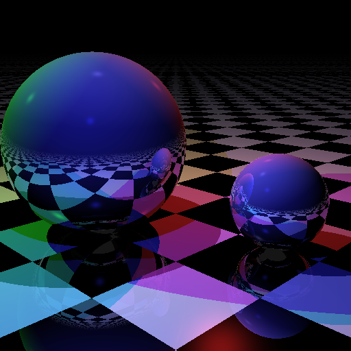

Compile-Time Ray Tracer in Rust
================================

Introduction
------------
This in a Rust reimplementation of https://github.com/tcbrindle/raytracer.hpp. 
It tries to produce a ray traced image *entirely* at compile-time.
This means the final render is stored directly in the binary 
without performing any computations at run-time.

This implementation extensively exploits `const fn` nightly features to see 
what is the current state of compile-time evaluation in Rust.

Current limitations of `const fn`
---------------------------------
I tried to make this implementation as close as possible to the original, though, it wasn't always feasible.

C++ version uses templates to make RayTracer class generic over a scene 
to allow for rendering two types of scenes: statically and dynamically created. The similar applies to a canvas.
Unfortunately, it isn't possible to use generic bounds to constraint type 
to have a `const` implementation of the trait, so I hardcoded type of scene with some code duplication 
for run-time and compile-time versions.

Another thing is that right now Rust doesn't support `const` function pointers and closures
which are used in the original implementation within object surface property definitions.
I have replaced them with trait.

Also, it isn't possible to use `for` loops to iterate over slices in `const` context as it requires 
const implementations of `IntoIterator` and `Iterator` traits for slices.
A simple workaround is to use `while` loop with manual indexing.

Performance
-----------
It took almost 23 minutes to build this program on my machine (Ryzen 7 1700). 
Peak memory usage during compilation reached 6.6GB.
For comparison the run-time version executes in 1.4s on the same machine. 
It makes compile-time version 1000x slower. I was using `rustc 1.45.0-nightly (7f65393b9 2020-05-01)`.